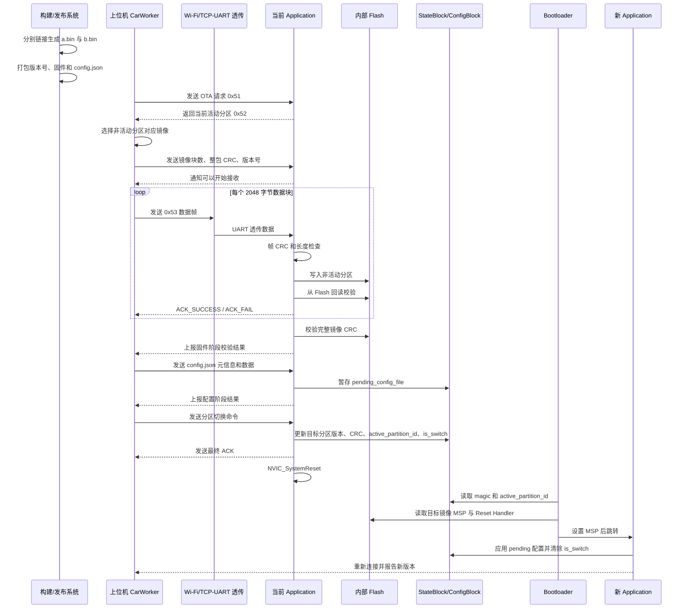

# 项目级 OTA 总览与学习地图

> 学习目标：不仅知道 OTA 的大概流程，还能从零搭建关键结构、手写核心代码、解释本项目中的变量与指针，并能判断当前实现距离生产级 OTA 还缺什么。

## 1. 学习方式

本课程严格按以下节奏推进：

1. 每次只学习一个知识点。
2. 每个知识点都包含：原理、从零如何搭建、本项目如何实现、关键代码逐句讲解、风险点。
3. 每个知识点结束后进行问答或手写练习。
4. 只有确认掌握后，才进入下一个知识点。

开发工程 `/mnt/d/Work/procedure_code/Bitbucket/clustercomm` 只作为代码范本读取；学习笔记和课程产物保存在当前目录。

## 2. 项目级 OTA 由哪些部分构成

```mermaid
flowchart TB
    OTA[项目级 OTA 系统]

    OTA --> BUILD[1. 固件构建与发布]
    OTA --> TRANSPORT[2. 固件传输协议]
    OTA --> APP[3. Application 升级执行器]
    OTA --> FLASH[4. Flash 与分区管理]
    OTA --> META[5. 状态与元数据管理]
    OTA --> BOOT[6. Bootloader 启动选择]
    OTA --> VERIFY[7. 完整性与安全验证]
    OTA --> RECOVERY[8. 断电保护与回滚]
    OTA --> CONFIG[9. 配置兼容与迁移]
    OTA --> TEST[10. 测试、诊断与发布治理]

    BUILD --> BUILD1[A/B 镜像分别链接]
    BUILD --> BUILD2[版本号与升级包结构]
    BUILD --> BUILD3[CI 构建与发布]

    TRANSPORT --> TRANS1[命令帧与数据帧]
    TRANSPORT --> TRANS2[分包、粘包、半包]
    TRANSPORT --> TRANS3[ACK、超时、重试、续传]

    APP --> APP1[接收非活动分区镜像]
    APP --> APP2[擦除、写入、写后校验]
    APP --> APP3[升级状态机]

    FLASH --> FLASH1[Bootloader/A/B/数据区布局]
    FLASH --> FLASH2[扇区擦除与字对齐]
    FLASH --> FLASH3[地址和容量边界保护]

    META --> META1[活动分区]
    META --> META2[镜像长度/CRC/版本/状态]
    META --> META3[原子提交与冗余副本]

    BOOT --> BOOT1[读取向量表]
    BOOT --> BOOT2[设置 MSP 和 VTOR]
    BOOT --> BOOT3[镜像选择与跳转]

    VERIFY --> VERIFY1[传输帧 CRC]
    VERIFY --> VERIFY2[整镜像 Hash/CRC]
    VERIFY --> VERIFY3[数字签名与防降级]

    RECOVERY --> REC1[下载时断电]
    RECOVERY --> REC2[切换时断电]
    RECOVERY --> REC3[试运行确认与自动回滚]

    CONFIG --> CONFIG1[active/pending 配置]
    CONFIG --> CONFIG2[新固件解析新配置]
    CONFIG --> CONFIG3[配置失败恢复]

    TEST --> TEST1[故障注入]
    TEST --> TEST2[日志与升级结果上报]
    TEST --> TEST3[兼容性矩阵与量产烧录]
```



不支持 Mermaid 时，可以使用下面的文字结构：

```text
项目级 OTA
├── 构建：如何产生可升级的 A/B 固件
├── 传输：如何可靠地把固件送到设备
├── 下载：当前应用如何写入非活动分区
├── 校验：如何确认收到的镜像正确且可信
├── 提交：如何原子地修改活动分区
├── 启动：Bootloader 如何选择并跳转新镜像
├── 确认：新固件如何证明自己能正常运行
├── 回滚：启动失败如何恢复旧固件
├── 配置：新旧版本配置如何安全迁移
└── 测试：如何验证断网、断电、坏包和版本兼容
```

## 3. 端到端 OTA 流程



生产级闭环还应在最后加入：新固件试运行、启动成功确认、超时或反复复位时自动回滚。本项目当前尚未完整实现这一部分。

## 4. 从零搭建项目级 OTA 的正确顺序

不能先从 UI 或“发送文件”开始。正确顺序如下：

| 顺序 | 先解决的问题 | 主要产物 |
|---|---|---|
| 1 | MCU Flash 多大、扇区如何分布、最大镜像多大 | Flash 分区表 |
| 2 | Bootloader 怎样判断镜像有效并安全跳转 | 最小 Bootloader |
| 3 | A/B 应用怎样链接到不同地址 | 两份链接脚本或参数化构建 |
| 4 | 用什么元数据记录活动分区和镜像状态 | 镜像头、StateBlock、冗余状态页 |
| 5 | 当前应用怎样只写非活动分区 | Flash 擦写和边界保护层 |
| 6 | 固件怎样分块、编号、校验、确认和重试 | OTA 传输协议 |
| 7 | 上位机和下位机怎样同步阶段 | 双端状态机 |
| 8 | 什么时候允许切换活动分区 | 完整镜像校验与原子提交 |
| 9 | 新镜像启动失败怎么办 | 试运行、确认、看门狗、回滚 |
| 10 | 如何阻止伪造固件和旧版本降级 | Hash、签名、公钥、防降级计数器 |
| 11 | 配置格式变化怎么办 | 配置暂存、迁移和恢复策略 |
| 12 | 如何证明系统可靠 | 断电、断网、坏包、越界等故障注入测试 |

## 5. 本项目当前的模块映射

### 5.1 固件构建层

- `RCCdemo/STM32F407XX_FLASH_BOOTLOADER.ld`：Bootloader 链接到 `0x08000000`。
- `RCCdemo/STM32F407XX_FLASH.ld`：A 应用默认链接到 `0x08020000`。
- `RCCdemo/cc_run.sh`：编译 Bootloader、A 包、B 包并打包。
- `Jenkinsfile`：组合下位机固件、上位机程序和版本信息并发布。

### 5.2 上位机 OTA 层

主类：`uppper/car_worker.py::CarWorker`

| 函数 | 职责 |
|---|---|
| `ota_upgrade_process()` | 接收升级任务、版本号和包路径 |
| `start_firmware_upgrade()` | 上位机 OTA 总状态机 |
| `send_OTA_upgrade_request()` | 发送 0x51 升级请求 |
| `receive_ack_msg_with_partition()` | 获取当前 A/B 分区 |
| `send_firmware_information_to_car()` | 选择 a.bin/b.bin，发送块数和整包 CRC |
| `send_package_version_to_car()` | 发送版本字符串帧 0x54 |
| `send_firmware_data_to_car()` | 循环发送 2048 字节数据块 |
| `send_config_data_to_car()` | 复用数据帧发送 config.json |
| `send_switch_partition_msg()` | 请求提交新分区 |

### 5.3 下位机 Application OTA 层

主入口：`RCCdemo/Core/Src/demo.c::firmware_update()`

| 函数 | 职责 |
|---|---|
| `reply_ack_msg_with_partition()` | 返回当前活动分区 |
| `wait_for_data_frame()` | 等待并拼接指定长度的 UART 数据 |
| `receive_firmware_information_from_upper()` | 解析块数和整包 CRC |
| `receive_package_version_from_upper()` | 接收版本字符串 |
| `receive_firmware_data()` | 接收所有固件块 |
| `check_crc_for_date_frame()` | 校验完整数据帧 CRC |
| `check_FH_for_date_frame()` | 解析帧头、有效长度和数据指针 |
| `check_date_filling()` | 将末帧补齐到4字节对齐 |
| `write_data_frame_to_flash()` | 转成32位字并写入 Flash |
| `check_data_frame_in_flash()` | 回读当前块并校验 |
| `check_ota_firmware()` | 校验完整镜像 CRC |
| `receive_config_data()` | 将配置文件接收到 RAM |
| `receive_switch_partition_msg()` | 等待最终切换命令 |

### 5.4 Flash、状态和配置层

主要文件：`RCCdemo/Drivers/BSP/STMFLASH/stmfalsh.h`、`stmflash.c`

| 结构或函数 | 职责 |
|---|---|
| `PartitionInfo` | 记录分区 CRC、状态、版本和签名字段 |
| `StateBlock` | 记录 magic、is_switch、活动分区和 A/B 信息 |
| `ConfigBlock` | 保存 active 与 pending 两份 config.json |
| `OtaState` | 保存运行期间的 OTA 阶段状态 |
| `stmflash_write()` | 擦除并按32位字写内部 Flash |
| `stage_config_file_content()` | 将新配置暂存到 pending 区域 |
| `apply_pending_config_file()` | 新固件启动后应用 pending 配置 |
| `update_partition_ota_result()` | 提交目标分区、CRC和版本 |
| `ota_data_init()` | 启动时初始化状态并处理配置迁移 |

### 5.5 Bootloader 层

- `RCCdemo/Core/Src/main_bootloader.c::main()`：Bootloader 启动入口。
- `RCCdemo/Core/Src/bootloader.c::iap_load_app()`：读取 StateBlock，选择 A/B，读取 MSP 和 Reset Handler，跳转应用。

## 6. 当前具备与尚缺的能力

| 能力 | 当前状态 |
|---|---|
| A/B 双镜像 | 已实现 |
| 非活动分区下载 | 已实现 |
| 分块传输与逐块 ACK | 已实现 |
| 数据帧 CRC 与整镜像 CRC | 已实现 CRC-16 |
| 版本号记录 | 已实现 |
| 配置 pending/active 迁移 | 已实现基础流程 |
| Bootloader 分区选择和跳转 | 已实现基础流程 |
| 严格的 TCP/UART 流式分帧 | 不完整，仍有边界风险 |
| Flash 写入错误逐层返回 | 不完整 |
| 状态块冗余和断电原子提交 | 未完整实现 |
| 新固件试运行确认 | 未实现完整闭环 |
| 启动失败自动回滚 | 未实现 |
| 数字签名和公钥验证 | 未实现，现有 signature 只是占位数据 |
| 防降级 | 未实现 |

## 7. 后续单知识点课程顺序

1. 项目级 OTA 的边界：OTA、IAP、Bootloader、升级包分别是什么。
2. STM32F407 Flash 扇区与本项目分区表。
3. 链接地址、向量表、MSP、Reset Handler、VTOR。
4. 从零手写最小 `jump_to_app()`。
5. A/B 镜像构建与 `a.bin`、`b.bin` 的差别。
6. StateBlock、PartitionInfo 与状态提交。
7. 上位机 OTA 状态机。
8. 下位机 OTA 状态机。
9. 8字节控制帧和40字节版本帧。
10. 2056字节数据帧逐字节解析。
11. TCP、UART、IDLE 中断、半包与粘包。
12. CRC-16 的计算、覆盖范围与能力边界。
13. STM32F4 扇区擦除与32位写入。
14. `uint8_t *`、`uint32_t *`、二级指针和地址递增。
15. 末帧补齐、镜像长度和分区越界保护。
16. 配置文件 pending/active 迁移。
17. 原子提交和断电保护。
18. 试运行确认、看门狗与自动回滚。
19. Hash、数字签名、防篡改和防降级。
20. 当前工程 OTA 缺陷审查与改进设计。
21. 脱离项目手写一个最小但完整的 A/B OTA 框架。
22. 面试表达、追问题和白板手写模拟。

## 8. 掌握确认规则

每个知识点结束时，使用以下标准判断是否进入下一节：

- 能否不看代码，用自己的话说明它解决什么问题。
- 能否画出它的输入、输出和上下游关系。
- 能否解释本项目中关键变量、地址和指针。
- 能否手写最小实现或伪代码。
- 能否指出当前实现至少一个风险点。

任何一项不清楚，就停留在当前知识点继续通过例子和问答巩固。
